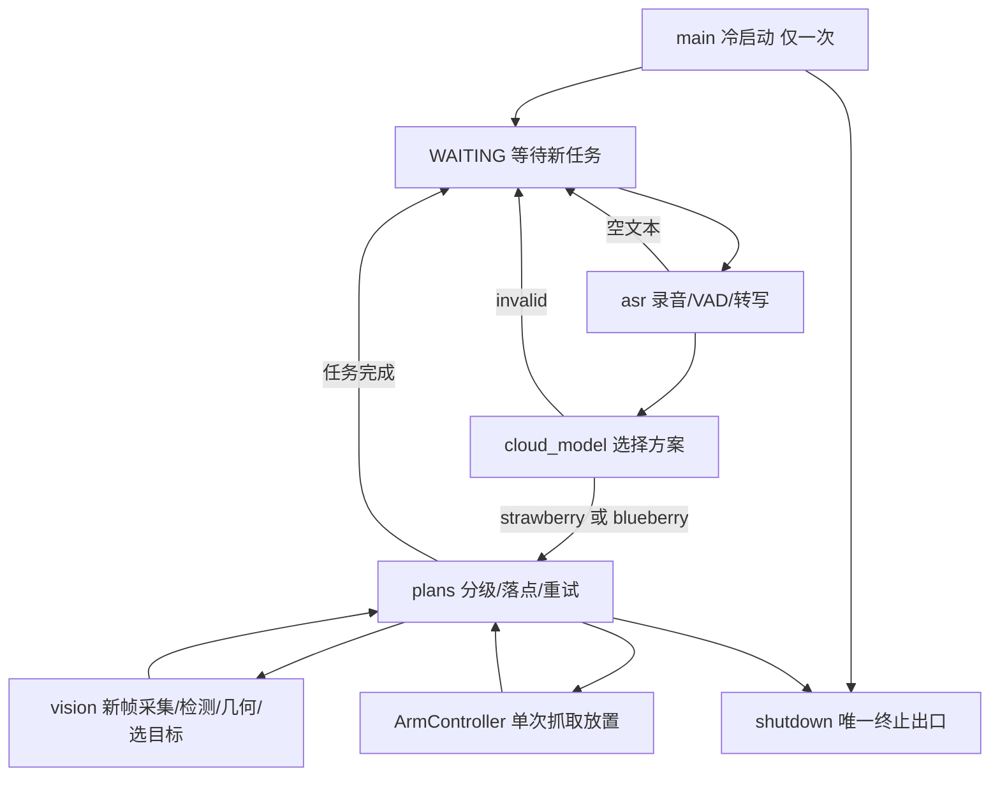

# 上层—视觉—运动完整功能落地方案

> 编制日期：2026-09-22。依据《上层任务编排模块技术文档》《视觉-plan-运动方案设想》，并核对当前公共接口、运动控制实现、测试、prompt 与真机 profile。
> 本文是实施方案；“建议补充”表示对现有契约的明确完善，不表示已经实现或通过实测。本次仅新增本文，不修改运行代码、原契约或标定数据。
> 2026-09-22 后续状态：正在按用户要求逐项确认冲突，并拆分为六份编码技术文档。D01–D05 已确认：英文 task、失败预算 10、临时跳选、槽位分配即消耗、各果品独立 K；D06 运动参数及其它建议尚待确认。决定以 [实施文档的决策记录](实施文档/README.md) 为准。
> D06 已收敛本期目标为草莓 demo：本文原有蓝莓实现、双果品模型/参数和双果品验收均不作为本期交付要求；以[六阶段实施规格](实施文档/README.md)为准；D07已确定蓝莓口令返回invalid。
> 2026-09-22 后续：D08（运动后规划失败一律 terminate）、D13（回车即确认，严格确认协议否决）、D14（ignore 封顶→terminate）已在 [实施决策记录](实施文档/README.md) 冻结；本文 §6.3 尺寸行、§7.3 骨架、§7.4 恢复矩阵的相关行以随文标注为准废止/修订，最终规格以 P1–P5 实施文档为准。

依据：[上层契约](上层任务编排模块技术文档.md)、[视觉接口契约](视觉-plan-运动方案设想.md)、[运动契约](机械臂运动控制模块技术文档.md)、[公共接口](../configs/common_interface.py)、[运动实现](../qingyun/grabbing/arm_control.py)、[标定清单](../参数标定清单.md)。

## 1. 交付目标与当前差距

交付一个同进程、同步阻塞的分拣程序：冷启动检查并恢复 home → 等待语音 → ASR → LLM 选择草莓方案或invalid → 每轮重新采集视觉 → plans 分级和分配落点 → 运动执行 → 分发结果 → 完成后重新等待下一条语音。

保持现有职责边界：视觉负责“哪个目标可抓、在哪里、尺寸与成熟度”；plans 负责“如何分级、放哪里、何时重试或结束”；运动负责“一次抓取—放置及自身故障处置”。LLM 只选择预注册方案，不生成坐标、运动指令或可执行代码。

### 1.1 已核对的仓库事实

| 项目 | 当前状态 | 实施影响 |
|---|---|---|
| `main.py`、`qingyun/asr.py`、`qingyun/cloud_model.py`、`qingyun/watchdog.py`、`qingyun/grabbing/vision.py` | 均为 0 字节占位 | 上层及视觉需要实际开发，不能按“已有模块联调”估算 |
| `configs/common_interface.py` | `VisionInterface` 已是 position/yaw/length/width/ripe/valid_count 六字段 | 类型改造已开始，不应重复新增另一套接口 |
| `ArmController._validate_target()` | 仍要求 `grade` 存在且为字符串 | 新接口对象会被判 `INVALID_INPUT`；“运动代码零引用 grade”的文档结论不符合当前代码 |
| `tests/support.py`、`tests/test_grasp_flow.py` | 仍有 `VisionInterface(..., grade=...)` 及 grade 校验测试 | 构造阶段即与新数据类不兼容；测试须同步迁移 |
| `prompt.md` | 已用 `strawberry/blueberry/invalid`，且有 invalid 示例 | 初核时原契约仍为数字；D01 已确认统一英文并同步上层契约 |
| 上层 §6 失败预算 | 初核时同时存在默认 10 和 3 | D02 已确认统一 10，并同步原契约 |
| 真机 `calibration/REAL_ARM/PC/profile.json` | `status=draft`、`verification=null` | 当前生产 real 加载器会拒绝，不能通过改状态字段绕过验收 |
| 真机 places | 仅 `default` 和 `bin`；`bin` 中心落在当前 target bounds 内 | 缺两套分级落点，而且现有 `bin` 不满足放置区在 ROI 外的前提 |
| 视觉误差预算 | 文档位置验收 ≤5 mm；profile 当前位置误差上界 4 mm | 达到 5 mm 不一定满足运动使用的 4 mm 包络，必须统一 |

以上是静态核对结果（**2026-09-22 P0 初核快照**），未运行真机或宣称现有测试通过。其中“仍要求 `grade` 存在且为字符串”“仍有 `VisionInterface(..., grade=...)` 及 grade 校验测试”两项**已由 P0-01 于 2026-09-23 完成迁移**：`_validate_target` 现只校验 position/yaw、接口层 grade 引用清零、tests 构造点已改六字段（现行为准，见运动文档 §3.2 与公共接口）。本表保留为初核历史记录。公共接口的首个交付应是“类型、调用方、校验、测试、文档一起可用”。

### 1.2 两种完成标准

- **软件闭环完成**：离线替身覆盖两种方案、全部结果分支、重复任务与统一退出，现有运动回归通过。
- **真机 demo 完成**：目标机运行同一套业务逻辑，真实语音触发，真实视觉和机械臂完成分拣，结束后返回 WAITING；现场观察与日志一致。

“任务完成”沿用既有停止规则，不等价于“所有物体均成功分拣”。三次 NoTarget 和 ignore 封顶都必须记录具体结束原因、成功数与失败数。

## 2. 开工前冻结的规则

| 事项 | 本方案采用的实施口径 |
|---|---|
| task 标识 | D01 已确认：统一 `"strawberry"/"blueberry"/"invalid"`，保留当前 prompt；迁移原契约、注册表及测试，不兼容旧数字 task |
| 失败预算 | D02 已确认 `MAX_CONSECUTIVE_FAILURES = 10`，定义在 plans 公共常量处 |
| 分级 | `not ripe → C`；成熟且 `length_m * width_m >= K → A`；其余 B；K 单位 m² |
| 方案差异 | D05 已确认：共同分级公式，各果品分别标定 K，另有各自落点映射；运动参数是否分别标定切换等待 D06 |
| 计数器 | `no_target_streak / ignore / consecutive_failures / a_count` 全部为 Plan 实例状态，每项重置规则见 §7 |
| 完成优先级 | 先检查不可恢复状态/失控阶段；重试类再判断 ignore 封顶，之后判断失败预算 |
| 恢复 | 同时读取 `status / stage / holding / recovery_required`，不能仅按 status 开爪或 reset |
| 视觉配置 | 运动阈值只来源于已加载 profile；视觉不导入 motion、plans 或 main |
| 退出 | `terminate()` 不发舵机命令、不回 home、不关扭矩；运动自身的保持/故障处理仍由运动侧负责 |
| 并发 | 业务链不创建线程、异步任务或并行抓取；SDK/推理库的内部执行不获得串口或业务调度权 |

需要修正文档中的两个推论：

1. 当 `valid_count=12、N=10` 时，第十次失败得到 `ignore=10<12`，失败预算就会终止。因此预算并非只在 NoTarget 绕路时触发；仅当候选数不超过 N 且排名稳定时，封顶才一定先于预算。
2. 每次视觉重新排名且没有目标身份跟踪，`ignore >= 上次 valid_count` 只能表示按既定 skip 策略结束本轮，不能证明“每一个物理目标都恰好试过一次”。保留现算法，修正日志与文档表述。

## 3. 模块结构与配置归属



建议新增/调整的文件：

```text
main.py                            # 组装依赖、启动恢复、主循环
configs/common_interface.py        # 已有六字段目标；必要的纯数据配置类型
configs/app_config.py              # 上层配置解析、路径与跨模块预检（新增）
configs/app.example.json           # 非机密配置示例
configs/secrets.example.json       # 仅空值/占位示例
configs/secrets.local.json         # 本地密钥，gitignore
configs/vision.example.json        # 相机、模型、标定文件引用
qingyun/asr.py                     # 同步录音、VAD、ASR 适配
qingyun/cloud_model.py             # prompt、云调用、严格解析、一次违约重问
qingyun/shutdown.py                # 替换当前空 watchdog.py
qingyun/plans/__init__.py          # 固定方案注册表
qingyun/plans/base.py              # 共用 run、分级、计数器和恢复
qingyun/plans/strawberry.py        # 草莓 place_id 列表与固定落点
qingyun/plans/blueberry.py          # 蓝莓 place_id 列表与固定落点
qingyun/grabbing/vision.py          # 单体视觉及私有管线函数
tests/test_plan_flow.py
tests/test_asr_flow.py
tests/test_cloud_model.py
tests/test_vision_pipeline.py
tests/test_main_flow.py
tests/test_shutdown.py
tests/fixtures/                    # 人工标注的离线 RGB-D/检测记录/音频
```

不要为首版引入消息队列、ROS、插件框架、通用工作流引擎或视觉子进程。依赖冲突确实出现且无法在同环境消解时，再启用原文档的 stdin/stdout 同步子进程方案。

### 3.1 配置单一来源

| 数据 | 存放位置 | 读取者 |
|---|---|---|
| 关节、home、中转点、抓取包络、碰撞净距、places | 现有 motion profile | main 调用 `load_motion_params()`；ArmController 消费 |
| 方案号、A 落点有序列表、B/C 固定 ID、K、失败预算 | plans 文件 | plans；坐标仍只从 `arm.params.places` 解析 |
| 相机设备、流配置、模型路径、类别映射、检测阈值、标定引用 | vision 配置及标定包 | vision |
| 麦克风、录音设置、云服务 endpoint/model、请求超时 | app 配置 | asr/cloud_model |
| API key | `configs/secrets.local.json` | 对应云适配器；日志不输出 |
| prompt | 根目录 `prompt.md` | cloud_model 启动时读取一次 |

运动 profile 的顶层键有严格校验，不应直接塞入 ASR、LLM 或 YOLO 配置。所有相对路径相对于所属配置文件解析，不依赖启动目录；运行开始记录 profile、模型和外参文件哈希。

**建议补充初始化接口**：`vision.configure(config) -> None`，随后保持原 `vision.init() -> None`。main 将已验证的运动阈值提取为不可变纯数据快照，与相机配置一并注入；配置类型可放公共接口，vision 只导入该类型。这样既不重复维护阈值，也不迫使视觉导入 `motion_params`。configure 只能在 init 前调用；初始化后禁止换配置。

为 asr/cloud_model 同样增加显式初始化入口，加载模型、配置和 prompt；原业务签名 `listen_and_transcribe()`、`select_plan(text)` 保持不变。测试替换边界调用，不依靠全局真实设备。

### 3.2 预检

启动前检查所有注册方案的 place_id 存在、A 列表无重复、A/B/C 不意外共用同一槽位、K 已标定且为正数、模型和外参可读、密钥完整。优品列表由方案显式声明顺序，不以 JSON 字典或字符串排序隐式分配。

新落点建议命名 `strawberry_A_01...`、`strawberry_B_bin`、`strawberry_C_bin`，蓝莓同理。这些是拟新增 ID，不能把现有 default/bin 自动充当它们。允许两方案在不同任务中复用物理托盘，但必须记录现场清空前提。

## 4. 冷启动、主循环与终止

### 4.1 启动顺序

具体顺序与公开接口以[P1 §4](实施文档/P1_任务编排与运行生命周期技术文档.md)为准：配置→日志→完整参数→预检→驱动安全握手→ArmController→共享冷启动复位→ASR/LLM初始化→vision配置及初始化→ready→run_session。

D17：首次可能上力前必须读回六轴全部卸力，否则拒绝且不写目标/力矩。目标预置本身可能隐式上力，失败清理只在驱动启动事务内执行；运行期terminate不追加舵机命令。现有默认initialize尚未具备完整握手，归P1实现，不能仅调用旧代码即宣布满足。

生产固定读configs/app.local.json；独立mock入口跳过真实ASR/LLM init，使用统一SimTime，预检与run_session显式接收同一注册表；共享会话不再次初始化设备。

home 判断只证明关节姿态，不证明空爪。保留原文档“home 容差内不自动开爪”的规则，并把开机已空爪、场地已清写入操作前提；若要自动判空或每次开爪，应作为启动契约变更明确增加。

`open_gripper / move_joints / reset_fault` 失败是抛出异常，不返回 `GraspResult`；主程序和恢复函数必须接住这些异常并 terminate，不能只处理抓取返回码。`wait_settled()` 返回 False 同样视为失败。

### 4.2 顶层循环

```python
while True:
    text = asr.listen_and_transcribe()
    if not text.strip():
        continue
    task_id = cloud_model.select_plan(text)
    if task_id == "invalid":
        continue
    plan = PLAN_REGISTRY[task_id](arm)  # 每个任务新建实例
    plan.run()
    print("任务完成")
```

此处是正常路径骨架：外层还需捕获云/视觉硬错误、原语异常、KeyboardInterrupt 和未预期异常，全部进入 terminate。`SystemExit` 不被通用捕获后再次包装。PLAN 运行期间不录音、不提交云请求、不缓存下一项任务。

### 4.3 终止规则

- `terminate(status, detail)` 输出任务、模块/阶段、原始原因、机械臂保持是否可靠及现场处置指引，最终 `sys.exit(1)`；stage 可置于 detail 或独立日志上下文，不擅自更改已有签名。
- `FAULT_UNCONTROLLED` 是 `GraspResult.stage`，不是 status。即使 status 属于可重试集合，也必须首先终止，禁止再 reset 或读串口尝试恢复。
- terminate 和 atexit 均不得调用 `hold_current / open_gripper / move_joints / configure_torque(False)`。退出前已经由运动处理的保持不重复执行。
- atexit 只负责幂等日志刷新和无舵机写入的资源释放，不再次 sys.exit，不宣称能处理 SIGKILL/断电。现有 motor.close 仅关闭传输，可在确认无写入的清理路径使用。
- 给终止与清理加调用次数保护，避免异常发生于初始化半途中时访问未构造资源。

## 5. 录音、ASR 与方案选择

### 5.1 录音和 VAD

采用阻塞式音频读取；不以音频 callback 驱动业务线程。原始采样率和声道数来自设备能力，持续降混和带状态重采样为 16 kHz mono，按锁定 VAD 模型需要的帧长送入推理。

Silero 可使用 PyTorch 或 ONNX，官方明确纯 ONNX 路线需要自行处理 I/O 和包装。建议目标机先验证 ONNX 路线，若现有视觉运行栈已固定 PyTorch 且安装验证更顺利，可统一复用；版本在目标机通过后锁定，不在方案中臆定兼容组合。[Silero 官方说明](https://github.com/snakers4/silero-vad)

状态机按文档实现：WAITING 无总超时；首个语音触发后才起 30 s 计时；连续静音 ≥1000 ms 结束；未结束且 30 s 到点则丢弃整段、打印一行并返回空串。边界优先级固定：同一处理步同时满足结束与上限时，先判断是否已形成完整静音终点，再决定丢弃，并用边界测试锁住。

建议保留约 200 ms 前置缓冲以保护句首，属于录音实现细节，不改变 30 s 起表点。每次录音结束/丢弃后清空音频缓冲并复位 VAD 时序状态。换任务后重开或排空输入，不能把抓取期间积压的麦克风数据当成新命令。

上传内容为 16 kHz、单声道、PCM16 WAV。空文本返回空串；麦克风断开、重采样/模型失败、上传失败分别保留来源，统一作为不可恢复的录音/ASR 错误结束。30 s 仅限制录音，云请求另设有限连接和总请求时限。

### 5.2 云服务适配

厂商尚未确定，首版只实现一个实际开通的 ASR 和一个实际开通的 LLM；厂商调用细节封装在各模块私有适配函数，不建设多供应商路由。入选条件：ASR 接受约定 WAV、中文实测可用；LLM 支持 JSON mode；两者在目标机可达、超时可控，并能关闭 SDK 默认重试。

API key 放本地 secrets 文件并加入 gitignore，仓库仅提交空值模板；日志记录请求标识、耗时及错误类别，不输出认证头。运行时网络、鉴权、限流、服务错误都为硬失败，禁止把 SDK 的自动重试与“LLM 违约重问一次”混为一谈。

### 5.3 LLM 输出校验

固定协议 `{"task": "strawberry"|"blueberry"|"invalid"}`。只接受一个 JSON 对象且键集合恰为 `{task}`、task 是上述字符串；旧数字字符串、数字、布尔、未知 ID、额外字段、重复 task 键、代码块包装或附带说明均为违约。

第一次违约：重新创建上下文，仅发送启动时加载的同一 prompt 和同一转写文本，不携带上次输出或纠错对话；第二次仍违约：记录并返回 `"invalid"`。任一请求硬失败直接抛 LLMHardError，不消耗“再问一次”作为网络重试。

prompt 示例保持英文：草莓→`strawberry`，蓝莓→`blueberry`，天气/闲聊/无法选择单一方案→`invalid`。无需关键词捷径绕过模型。方案注册使用固定字典，禁止把输出交给 eval、动态路径导入或 shell。

> 2026-09-23 D18/D19：视觉具体几何算法、D2C像素/坐标规则、点集拟合及足迹padding以[P3](实施文档/P3_视觉检测与目标选择技术文档.md)为唯一实现定义。旧讨论不授权直接换算图像框角度/尺寸；本期实物长宽高由用户保证在固定包络内。

## 6. 视觉模块落地

### 6.1 初始化与模型交付

`vision.init()` 显式完成相机枚举、RGB/Depth 流设置、配准验证、相机内参与外参加载、YOLO 权重加载及首次管线检查。模型和外参使用本地受版本管理的发布清单，运行期不临时下载权重。

仓库 README 指向奥比中光相机，但具体型号未在这两份文档中固定；先按实机型号选择 SDK 分支、固件和 Python 版本。官方 Python SDK 对不同设备与 SDK 分支有支持范围说明，应以实机枚举与目标机试采为准，不能默认任一相机都可直接使用同一 wheel。[Orbbec 官方 Python SDK](https://github.com/orbbec/pyorbbecsdk)

建议采用能输出实例轮廓的 YOLO 分割模型，输出成熟度类别及 mask；官方分割接口提供实例 mask、类别和置信度，适合把目标点云从桌面与邻物中分离。[Ultralytics 分割接口](https://docs.ultralytics.com/tasks/segment/)

若视觉组已有通过验证的检测模型，可保留并补充可靠的轮廓提取。普通水平框的宽高不足以直接确定物体长轴、真实尺寸和 yaw，不能仅换算 bbox 像素就交付六字段接口。

模型交付包含：类别到 ripe 的固定映射、权重哈希、预处理/后处理、推理运行时版本、训练集与独立验证集说明。数据覆盖两种果品、成熟/未成熟、目标区各位置、不同朝向、邻近摆放与现场光照；不同采集场次划分训练/验证，避免连续帧泄漏。

方案号不传给视觉。一个已加载模型需要覆盖演示允许出现的果品与成熟度；桌面仅一种物体的前提仍保留。语音要求与桌面品类相符由操作规范保证，当前接口没有输出品类供 plans 复核。

### 6.2 单次 get_target 管线

1. 获取本次调用的新 RGB-D 数据；验证配准、时间戳和深度尺度。丢弃驱动队列中过旧帧，尤其不能使用机械臂返回 home 之前的帧。
2. 检出所有相关物体。检测区域覆盖 ROI 及邻近影响区，避免 ROI 边外的物体被裁掉而漏算净距。
3. 对每个实例提取有效深度/点云，去掉桌面和明显离群点，转换到 base_link。
4. 估计物体中心、水平长/短轴、尺寸、yaw 与 ripe；保留内部高度、轮廓和几何质量信息，不增加公共目标字段。
5. 基于全体检出物体计算邻距；执行置信度、数据质量和可抓性过滤。
6. 对合法候选按唯一规则排序，令 `valid_count=len(valid_candidates)`。
7. 全量记录候选及拒绝原因；若 `ignore >= valid_count` 抛 NoTarget，否则返回索引为 ignore 的目标。

几何计算应在已去畸变、与所用深度配准一致的相机模型上进行：

```text
p_camera = deproject(pixel, depth_m, calibrated_intrinsics)
p_base   = R_base_camera @ p_camera + t_base_camera
yaw      = wrap180(degrees(atan2(long_axis_base_y, long_axis_base_x)))
```

用基座点云的 XY 轮廓拟合长轴/有向包围矩形，而不是直接沿用图像平面的旋转角。`position.z` 是物体几何中心高度，不是相机看到的顶面深度。单层着桌条件下可使用“已标定桌面＋目标形状/高度模型”估计中心，但这种估计必须独立验证；不可见背面造成的误差需要纳入 CAL-040。

近圆形蓝莓的长轴可能不稳定，需要在拟合器、标注与验收中约定一致的退化处理。不能简单填写 0°并声称达到 5°测量精度；如果实际样本无法满足当前长轴契约，应先收敛演示样本范围或修订该品类的姿态语义，这是蓝莓验收前置项。

### 6.3 过滤与确定性排名

| 检查 | 实施规则 |
|---|---|
| 数据有效性 | position 为有限 float64 `(3,)`；`length_m >= width_m > 0`；ripe 严格布尔；yaw 在 `[-90,90)`。正尺寸是数据合法性要求，不是新增最小可抓果径 |
| 位置 | center 在注入的 `workspace.target_bounds_m` 内，边界规则与运动文档一致 |
| 闭合轴尺寸 | **（D10 已定稿为逐轴比较：`length_m ≤ envelope[0]` 且 `width_m ≤ envelope[1]`，本行原"投影尺寸"表述作废）**；不新增尺寸下限 |
| 其余尺寸 | **原"建议补充：内部点云同时验证长、宽、高不超完整运动包络"已被 D10 否决（2026-09-23 标注）**：视觉只逐轴检查闭合两维上限（见上行）、不设下限、不查高度维；实物长宽高由 D18 演示样本前提保证（不逐个量具登记），运动不为超包络物体兜底（D10/R06）；超高目标若引发 COLLISION 按直死 terminate，风险写入 P3/P5 已知风险与现场操作规范 |
| 方向 | 不做基于 yaw 角值的可达性过滤，测量误差走验收；实际 IK 仍由运动判定 |
| 头顶净空 | 由抓取中心偏移、approach_height 和包络构建接近区域，深度中检查该区域是否被其他物体侵入；检查时排除目标自身及桌面 |
| 邻距 | 对全体检出物体计算，不先删掉尺寸不合格、ROI 外或低置信度候选再计算；最小净距 ≥ collision.clearance_m |

原文“中心距减半长半宽”的写法还需要固定双方足迹与朝向的具体计算。建议采用下式作为保守的矩形投影净距近似，过滤和排名只计算一次并共用结果：

```text
u_ij = (center_j.xy - center_i.xy) / distance_ij
r_i(u) = (L_i * abs(dot(long_axis_i,u))
        + W_i * abs(dot(short_axis_i,u))) / 2
d_ij = distance_ij - r_i(u_ij) - r_j(u_ij)
d_i = min(d_ij for all j != i)
```

重叠或中心重合的目标按净距不足处理；单目标内部以无限净距参与排序，日志输出 `isolated=true`，避免写出非法 JSON Infinity。若某邻物不能取得可靠三维几何，不把它静默当不存在：使用经过验证的保守占用估计，或拒绝受影响候选并记录无法验证净距的原因。

排序键固定为 `(-d_i, distance_to_roi_xy_center, x, y, z)`；位置中心来自 target bounds，禁止追加时间、置信度或随机 tie-break。测试保证同一组几何输入、不论检测器输出顺序，排序结果一致；新帧测量噪声仍可能改变顺序，不能承诺物理场景不变就逐比特一致。

### 6.4 空结果与硬故障

- 有效帧中无物体、合法候选全被过滤、ignore 跳尽 → NoTarget；日志分别写明原因。
- 相机离线、帧获取超时、配准/模型执行故障、整帧深度管线不可用 → VisionHardError。
- 单个候选局部缺深度 → 该候选拒绝并记录，不立即等同于整机故障。
- `get_target()` 不返回 None，不缓存上次目标，不在异常时回退上次坐标。
- `ignore` 必须是非负整数；返回的 valid_count 是总合法数，不能写成“剩余数”。内部不变量违约是程序错误，应终止而不是增加 NoTarget 计数。

## 7. plans 循环与恢复的完整实现

> D03 已确认临时跳选，D04 已确认优品槽位分配即消耗，D05 已确认两方案独立 K。D06 运动参数及其它待定接口仍需最终冻结。

### 7.1 分级和槽位

`Plan(arm)` 构造时根据方案的 ID 列表解析 `arm.params.places`，实例化所有计数器。视觉输出只在 plans 中计算 A/B/C；只向运动发送原 target 与 place_id。

`next_place_id(A)` 先查界，再取槽位并立即递增 a_count；B/C 返回固定箱口释放点。按既有契约不回滚槽位，因此不仅 GRASP_MISS，任何已分配 A 槽位后的失败都会消耗它。日志同时记录已分配槽位数和实际成功放置数，二者不能混淆。

K 分别用两种果品的人工定级样本及实测长宽乘积确定，并验证 `area==K` 归 A。D05 已明确方案差异包括分级阈值，禁止继续以共用 K 作为两方案默认行为。

### 7.2 四个计数器

| 事件 | no_target_streak | ignore | consecutive_failures | a_count |
|---|---:|---:|---:|---:|
| 新建 Plan | 0 | 0 | 0 | 0 |
| 成功返回目标 | 0 | 不变 | 不变 | 分到 A 时 +1 |
| NoTarget | +1 | 0 | 不变 | 不变 |
| SUCCESS | 0 | 0 | 0 | 不回滚 |
| 重试类失败 | 不变 | +1 | +1 | 不回滚 |

“成功检测”只清 NoTarget 连续计数；“成功抓取—放置”才清连续失败计数。NoTarget 三次之间不加入 sleep，每次都实际跑新管线。

### 7.3 run 骨架

```python
while True:
    try:
        target = vision.get_target(self.ignore)
    except NoTarget:
        self.ignore = 0
        self.no_target_streak += 1
        if self.no_target_streak >= 3:
            log_completion("NO_TARGET_STREAK")
            return
        continue

    self.no_target_streak = 0
    validate_target_contract(target, requested_ignore=self.ignore)
    grade = self.classify(target)
    place_id = self.next_place_id(grade)
    log_assignment(grade, place_id)
    result = self.arm.grasp_and_place(target, place_id)

    if result.stage == "FAULT_UNCONTROLLED":
        terminate_result(result)
    if result.status == SUCCESS:
        validate_success_contract(result)
        self.ignore = self.consecutive_failures = 0
        record_success(result)
        continue
    if result.status not in RETRYABLE_STATUSES:
        terminate_result(result)

    self.ignore += 1
    self.consecutive_failures += 1
    exhausted = self.ignore >= target.valid_count
    if exhausted:
        terminate("NO_GRASPABLE_TARGET", result.reason)
    if self.consecutive_failures >= MAX_CONSECUTIVE_FAILURES:
        terminate("FAILURE_BUDGET_EXHAUSTED", result.reason)
    self.recover_if_required(result)
```

> D14：封顶直接terminate，不恢复、不打印任务完成；具体分发与审计字段以P1 §6.2为准。

伪代码中的辅助函数是拟实现内容。`validate_target_contract()` 在 plans 再做必要边界检查，至少拦截非法尺寸/ripe、非正整型 valid_count、`valid_count <= requested_ignore`。失败映射为接口/视觉硬错误，不能触发抓取。运动入口仍只消费、校验 position/yaw；不把 plans 字段校验重新塞回运动。

### 7.4 恢复矩阵

先检查失控阶段和直死状态，再使用下表；ignore 封顶与失败预算优先级已经在主循环中决出。

> **D08/D13/D14 标注（2026-09-22）**：本表中 IK_FAILED/PLAN_INVALID 且 `recovery_required=True` 的两行（自动 reset / 人工确认）已被 **D08** 废止（一律 terminate，不分 holding）；"人工确认要求明确输入 `已空爪`"的严格协议被 **D13** 否决（维持回车即确认）；ignore 封顶已被 **D14** 改为 terminate，不再经本表恢复。

| 返回情形 | 恢复措施 |
|---|---|
| IK_FAILED / PLAN_INVALID，`recovery_required=False` | 视为运动前失败；在 home/空爪入口不变量成立时直接下一次视觉，不 reset、不搬臂。holding=UNKNOWN 可只是尚未执行夹持判断，不能单凭它强制人工介入 |
| GRASP_MISS，`recovery_required=True` 且 `holding=EMPTY` | 自动 `reset_fault()`，按已验收安全路线回 home |
| GRASP_UNCERTAIN / GRIP_SLIP，`recovery_required=True` | 打印现场状态，阻塞 `input()`；只有人工明确确认物体已处置、空爪且可恢复，才 reset 并回 home |
| IK_FAILED / PLAN_INVALID，`recovery_required=True`，`holding=EMPTY` | 可自动 reset 并回 home；不能假设所有规划错误都发生在 CHECK |
| IK_FAILED / PLAN_INVALID，`recovery_required=True`，`holding=HOLDING/UNKNOWN` | **补足原文遗漏**：与夹持不明相同，等待人工确认空爪后 reset 并回 home |
| 状态与标志组合违反约定，例如 MISS 却报告 HOLDING | terminate，保留原结果供定位，不猜测可继续 |
| reset 或任一回程原语异常 | 立即 terminate，不增加 ignore 后再试恢复 |

人工确认协议**已被 D13 修订（2026-09-23）**：原"要求明确输入 `已空爪`、空回车不算确认"的严格协议被否决，维持原上层契约——打印现场状态后 `input()` 阻塞，操作者回车即视为确认（空回车同样算确认），EOF/Ctrl-C 抛 EOFError/KeyboardInterrupt 照常接 terminate。确认期间不后台请求视觉或发送指令（同步阻塞天然保证）；操作者若不能确认，不进入 reset。`reset_fault()` 的当前实现不能证明物体已被移走，也不提供完整静止 dwell 证明，恢复助手须核验静止条件，不能把 reset 成功当成全部现场条件已满足。

回程助手只调用运动公开原语，依次经过已校验的安全中转点再到 home，并确认到位。正常 SUCCESS 已由 RETURN 保证 home，不额外重复回零。~~封顶要求恢复时，必须恢复成功才打印完成；不能在最后一次失败后直接返回 WAITING。~~ **（D14 修订，2026-09-23）**：ignore 封顶不再经本表恢复、不再"恢复成功后打印任务完成"，直接 terminate("NO_GRASPABLE_TARGET")、臂冻结于当次失败位；正常完成出口仅余 NoTarget×3。本表的 reset/回程恢复只适用于 GRASP_MISS / GRASP_UNCERTAIN / GRIP_SLIP（IK_FAILED / PLAN_INVALID 运动后已由 D08 一律 terminate，见上）。

## 8. 日志与可追溯结果

采用控制台简洁日志加 JSONL 详细日志，业务线程同步写入，记录 `session_id / task_id / scan_id / attempt_id`。grade 仅出现在 plans 自己的日志中；运动只看到 place_id。

| 事件 | 最低记录字段 |
|---|---|
| 启动 | 版本、运行模式、profile/权重/外参哈希、相机标识、启用方案 |
| 录音/云请求 | 触发、结束/超时原因、时长、转写、解析结果、请求耗时；机密脱敏 |
| 视觉扫描 | 帧时间、检出数、合法数、ignore、每个候选几何与逐项拒绝原因、排序结果 |
| 分配 | grade→place_id、a_count、候选 valid_count |
| 抓取返回 | status、stage、reason、holding、recovery_required、耗时 |
| 恢复 | 自动/人工、确认事件、reset、各回程段结果 |
| 任务结束 | NO_TARGET_STREAK、成功数、各失败码计数、已占用槽位数 |
| 终止 | 所处阶段、原异常、最后一次已知运动状态、是否无法保持 |

建议终端输出示例：`任务完成：结束原因=NO_TARGET_STREAK，成功=2，抓空=1，已分配优品槽位=3`。保留文档要求的“任务完成”，同时避免把未抓走目标掩盖成成功。

运动的故障返回 stage 可能已被改为 FAULT_HOLD，未必保留原执行阶段。日志直接标注返回阶段；若需要定位 CLOSE/LIFT 等原始阶段，应在运动内部失败发生点补日志，不能从状态码反推并伪造阶段。

图像回放与错误分析可以保存关键帧，但要限制数量/目录大小；无论是否保存图像，候选拒绝记录不得省略。

## 9. 测试与验收

### 9.1 离线测试矩阵

| 层级 | 必测场景 | 通过标准 |
|---|---|---|
| 公共接口迁移 | 新六字段对象进入 ArmController；所有旧 grade 构造点修订；不同 length/width/ripe/valid_count | 合法目标不因缺 grade 被拒；运动仍不按元数据选落点；原 position/yaw 拒绝行为保留 |
| ASR/VAD | 无限静音、短暂停顿、连续静音边界、30 s 边界、44.1 kHz 双声道输入、输入断开、ASR 空文本/异常 | 使用假时钟和音频 fixture 验证转移、PCM 格式、buffer 重置和硬错误分类 |
| LLM | 三种英文标识、旧数字字符串、数字类型、额外/重复键、非法 JSON、一次违约后合法、两次违约、请求硬失败 | 最多两次“语义请求”；第二次上下文与首次一致；硬错误不重试 |
| 视觉几何 | 已知外参点、尺度、顶面与中心区别、yaw ±90°跨界、缺深度、遮挡、尺寸上限、无尺寸下限策略 | 几何量与独立参考一致，拒绝原因可解释 |
| 视觉选择 | 被过滤邻物影响净距、ROI 边外邻物、单目标、排序平局、输入顺序扰动、ignore=0/V-1/V | 排名规则一致；valid_count 为全量；V 时抛 NoTarget |
| plans 正常路径 | A/B/C、面积等于 K、两方案映射、混合结果、两个连续任务 | 落点正确；新任务实例计数归零；成功后的重置规则正确 |
| plans 结束 | NoTarget×3；NoTarget→target→NoTarget；ignore 封顶与预算同次触发；V>N | NoTarget 连续语义正确；同次封顶优先；V>N 时预算可先到 |
| plans 恢复 | 各 retry 状态与 recovery/holding 组合、失控阶段、人工确认/EOF/Ctrl-C、复位失败、中转段失败 | 未确认不解锁；失控/预算终止后零新运动命令；回 home 后才再视觉 |
| 槽位 | A 失败消耗槽位、槽位耗尽、非法落点映射 | 不回滚、不越界继续抓取；明确配置/槽位错误 |
| shutdown | 任一阶段 Ctrl-C、半初始化退出、二次终止、atexit | 生产运行终止码 1；清理不新增串口目标/扭矩写入 |

用 FakeArm 检查业务调用顺序与命令数量，用现有 MockMotor + ArmController 覆盖真实运动返回路径。两者用途不同：FakeArm 通过不证明 IK/碰撞/驱动链通过。无需硬件或云服务即可跑上述逻辑测试。

迁移阶段先运行 `tests/test_grasp_flow.py` 及依赖公共 fixture 的相关测试；完整集成后运行现有全量 `pytest` 与新增上层测试。测试在项目既有 Python/Conda 环境执行，不能以本机另一解释器缺依赖作为代码测试结论。

### 9.2 真机与视觉验收

1. **模型和标定独立验证**：CAL-110 相机内外参/尺度，CAL-040 物体中心位置，CAL-041 无向长轴 yaw。采样覆盖 ROI 的中部、边缘、多种朝向和尺寸，验证集不复用拟合数据。
2. **误差预算统一**：位置满足 `实测误差 ≤ min(5 mm, grasp.target_position_error_bound_m)`；目前 profile 是 4 mm，所以按 4 mm 验证。若测量要求改为 5 mm，应更新参数并重算/验证受影响的运动包络，而不是只改验收记录。yaw 同样不超过文档 5°及 profile 使用的上界。
3. **可达性**：home 不遮挡、ROI 与实际 yaw 组合可达、所有抓取/放置路线有效。五姿态关节限制由现有 IK 验证；不能把 target bounds 内任意 yaw 都视为可达。
4. **落点**：逐点验证物体中心语义、释放高度、撤回路线、箱口开度和箱满条件。A 槽位按最大物体包络留足间隔；B/C 箱口释放不能碰已堆积物或造成不可接受损伤。
5. **果品适配**：蓝莓在同一抓取参数下的接触识别、抓空率与损伤单独试验；若无法稳定检测接触，则不能把“ignore 封顶完成”当成蓝莓功能验收。必要时扩展按品类标定的 motion profile，属于后续明确改造。
6. **分类**：混绿果场景记录成熟/未成熟混淆矩阵，以及 A/B 面积阈值人工一致性。原文未规定可接受误判比例，该比例需在最终模型验收前确定，不虚构已通过数值。
7. **闭环**：分别完成草莓、蓝莓的真实语音→选择→分级→放置→回 WAITING；再以空场景、抓空和人工恢复验证结束及异常路径。

演示成功一次是上层 demo 目标，不能替代 real profile 的标定发布要求。现有 profile 还要求独立抓取试验数量和成功/掉落/损伤统计；当前字段含 `min_grasp_trials=30` 等值，是否已正式确认必须依据标定记录复核。不得为赶 demo 将 draft 改成 verified。

## 10. 实施阶段、交付物和依赖

| 阶段 | 工作内容 | 可审查交付物 / 完成判据 |
|---|---|---|
| P0 契约修复 | 六字段接口全链迁移；移除运动 grade 检查；修订测试、motion 文档 §1.1/§3.2、README；统一 task 和 N；补恢复矩阵 | 一份独立改动，接口与运动回归通过；原两份文档待办状态与代码一致 |
| P1 配置与任务闭环 | app/secrets 模板、shutdown、plans、main；FakeASR/FakeLLM/FakeVision/FakeArm；初始化预检和驱动生命周期接入 | 离线串起两种方案、重复任务、全部计数/恢复/退出分支；初始化失败责任明确 |
| P2 语音和云接入 | 真实麦克风、VAD、WAV、ASR、LLM JSON mode、超时与违约重问 | 目标机能稳定把真实口令映射到 strawberry/blueberry/invalid；云异常按契约终止 |
| P3 视觉闭环 | 型号/SDK验证、数据集与模型、RGB-D配准、几何中心/尺寸/yaw、过滤/排名/ignore、逐项日志 | 离线几何测试及真实相机精度验收通过；保持机械臂不动完成视觉试采 |
| P4 标定与发布前验证 | 继续 tool→workcell→timing→motion→grasp→pick_place；新增全部 places；统一视觉误差预算 | 可核验的真实证据、参数与资源哈希；通过既有发布关卡生成 verified profile |
| P5 目标机全链联调 | 实物从单目标到多目标；本期草莓验收；故障与连续任务测试 | 固定版本、依赖锁定、现场操作说明、测试报告、回放日志及可重复 demo |

P0 完成后，语音实现、视觉研发、plans 离线开发可由不同负责人并行推进；这是工程分工建议，不改变运行时同步语义。真机链路的关键依赖是视觉几何精度、工具/工作区标定、落点与果品接触适配，不能只按代码量排期。

每阶段都交付可运行或可回放的产物。首个可运行版本用替身完成闭环，再替换真实语音与视觉；标定采集在既有标定工具路径进行，生产 main 始终要求 verified，避免“为生成验收数据先绕过生产门槛”的循环。

建议职责：视觉负责人交模型/外参/几何与误差报告；上层负责人交语音/方案/日志/退出；运动与标定负责人交公共接口迁移、恢复路线、落点及参数发布；集成验收共同确认接口与真机现象。

## 11. 目标机部署与现场操作

部署包固定代码版本、Python/SDK/推理依赖版本、VAD/YOLO 权重、相机标定包、已发布 motion profile、app 配置和 prompt。密钥由现场配置。先在 x86 开发机和目标 arm64 分别做导入/离线回放，再验证相机与麦克风；不依据开发机安装成功推断香橙派兼容。

建议增加以下入口参数；这些命令是拟交付接口，当前空 main.py 尚不支持：

```bash
python3 scripts/run_mock.py
python3 main.py
```

mock 必须完全不打开真实串口，使用 simulation profile 与确定的离线数据源；真实设备和云服务分别在模块联调脚本中验证。生产 real 的任务完成始终回 WAITING，不增加默认“跑完一次就退出”的分支。

启动前确认：六轴全部卸力、空爪、冷启动恢复通道已清、相机固定、ROI 内单层且只有一种果品、A 槽位已清空、箱内余量充足、语音任务与果品一致。任务结束后程序继续等待，下一条任务发出前清空/更换放置区；因为新实例会从 A_01 重新分配，不能连续往未清空托盘复用槽位。

现场记录每轮成功分拣、残留果、掉落、错分与损伤，和软件完成原因核对。进程终止保持既有目标的语义沿用运动文档；重启仍执行冷启动检查，不依赖上一进程内存里的 recovery_required。

## 12. 尚缺输入及其阻塞范围

这些信息不阻塞 P0/P1，但相应模块接实物前必须落实：

| 缺项 | 需要产出 | 最迟阻塞点 |
|---|---|---|
| ASR/LLM 厂商与模型、账号 | 可达 endpoint、开通额度、密钥、本地实测请求样例 | P2 真实云测试 |
| 相机型号/固件/目标机系统 | 已验证 SDK 分支、RGB-D 配准与时间戳试采 | P3 相机接入 |
| 训练权重与类别 | 支持两种果品的模型、ripe 映射、独立评估集 | P3 视觉验收 |
| 相机标定 | 内参、深度尺度、T_base_camera、测量与独立验证记录 | P3 空间精度验收 |
| grade 面积阈值 K | 两种果品各自的样本、人工等级、已确定的 m² 阈值（D05） | 分级实物验收 |
| 两套 place_id/坐标与容量 | A 有序槽位数量，B/C 箱口释放位姿，实测回程路线 | P4 workcell/放置验收 |
| 近圆蓝莓姿态与夹持适配 | yaw 退化约定、可用果径范围、接触与损伤试验 | 蓝莓真机验收 |
| 成熟度误判与最终抓取指标 | 预先确定的验收口径、现场混淆矩阵/试验报告 | P5 发布 |

推荐首先完成 P0 和 P1：把当前半迁移接口修完整，并交付可故障注入的任务闭环。这样视觉、语音和标定分别接入时，都有明确输入输出、恢复边界和验收依据。
