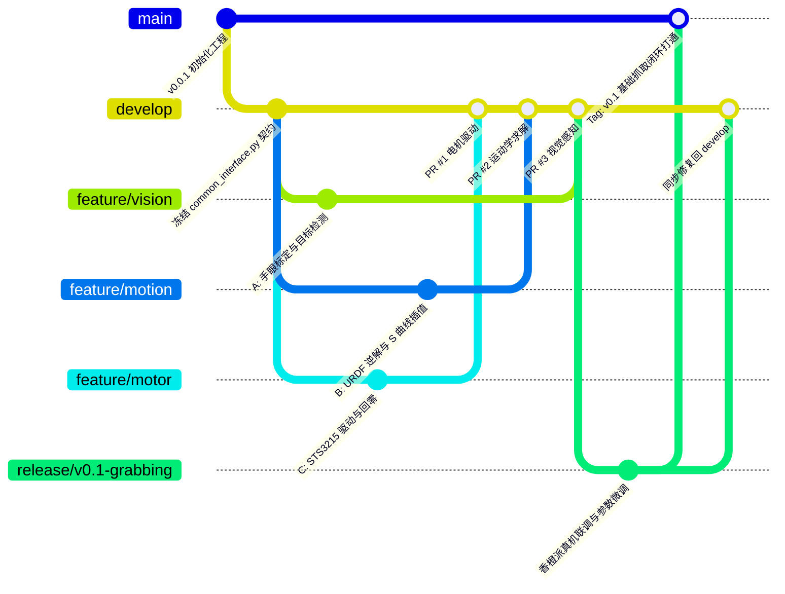

# 青云智臂
---

本项目由山西农业大学嵌入式实验室开发

## 开发规范

### 1.工程结构图
```
Qingyun_arm
├── configs                     # 配置文件
│   └── common_interface.py
├── libs                        # 库文件
│   └── so_arm_core
├── main.py                     # 程序入口
├── qingyun                     # 核心功能包
│   ├── asr.py                  # 语音转文字模块
│   ├── cloud_model.py          # 云端大模型模块
│   ├── grabbing                # 抓取模块
│   │   ├── arm_control.py
│   │   ├── motor_control.py
│   │   └── vision.py
│   └── watchdog.py
└── readme.md
```

### 2. 任务说明与分工

#### 前期开发

在开发前期，采用三人分工的合作模式，分工如下：  

---
**1号负责：开发项目的视觉部分，具体包括：**
- 在香橙派上驱动奥比中光深度相机
- 完成深度相机的手眼标定
- 训练模型与在香橙派上部署
- 输出目标的三维坐标与yaw姿态，以及目标品级
---

**2号负责：机械臂的运动学控制部分，具体包括:**
- 运动学正逆解
- 做好机械臂限位
- 规划机械臂运动路径
- 编排抓取动作流程
---
**3号负责：电机的控制部分，具体包括：**
- 电路与供电设计
- 完成舵机id烧录与零位和最大运动位置的标定
- 封装电机驱动
- 硬件级安全限幅

#### 开发后期

到时候再说

### 3. 接口约定

#### 常规约定

官方标准关节索引：*(需要确认)*
- 索引 0: shoulder_pan (底座旋转)
- 索引 1: shoulder_lift (大臂俯仰)
- 索引 2: elbow_flex (小臂俯仰)
- 索引 3: wrist_flex (手腕俯仰)
- 索引 4: wrist_roll (手腕旋转)
- 索引 5: gripper (夹爪, 0~100)
  


#### 开发前期接口约定

---
**视觉与算法接口约定：**
|     | 目标位置 | 目标角度 | 目标品级 |
|:---:|:-------:|:------:|:-------:| 
| 物理单位 | 米（m）| 角度制（deg） | A+ , A , B , C(不合格)|
| 数据类型 | 一个np.float64的np.array | float | 字符串 |
| 举例 | np.array([x,y,z]) | 12.3 | "A+" |

使用`VisionInterface`类封装数据进行传递  

---

**算法与电机控制接口约定:**

算法（运动控制）To 电机（驱动）——同进程函数调用，2号对 `MotorController` 接口编程，3号负责实现（`motor_control.py`），测试用 Mock 驱动实现同一接口：

| | 关节角度指令 | 夹爪开合 | 状态反馈 | 停止 |
|:---:|:-------:|:------:|:-------:|:---:|
| 接口 | `send_action(joints_deg, gripper_pct)` | 同左，`gripper_pct` 参数 | `get_feedback() -> JointFeedback` | `emergency_stop()` |
| 物理单位 | deg（5个姿态关节角） | 0~100（百分比） | deg / (deg/s) / mA | - |
| 数据类型 | `np.float64` 的 `np.array`（shape `(5,)`） | `float` | `JointFeedback` 数据类 | - |

配套接口：`wait_until_settled(timeout_s, tol_deg) -> bool`（阻塞等待关节静止）。

约定细则：
1. **`send_action` 必须非阻塞**：写入串口缓冲立即返回，内部禁止 `sleep`；内部先做关节行程软限位钳位（最后一道安全闸）再写总线。
2. **时钟节拍归算法侧（2号）**：30Hz 回放循环与绝对时间对齐由 2号维护，电机侧不持有定时循环。
3. **反馈同步读取**：`get_feedback` 一次返回 6 舵机（含夹爪）的角度、转速、电流。
4. **`emergency_stop` = freeze**：以当前实测角度持续下发锁定输出；物理急停按钮由 3号接入舵机供电回路直接断电，不经软件。

使用 `MotorController` Protocol（定义于 `common_interface.py`）约束双方实现。

详细设计见 `docs/机械臂运动控制模块技术文档.md`。

### 4. 使用git和github管理开发

本项目采用规范的 **GitFlow 分支管理模型** 与 **GitHub Pull Request (PR)** 协作流程，确保 3 位同学并行开发互不干扰，主干代码时刻保持真机高可用。

#### 4.1 GitFlow 分支模型架构图



#### 4.2 核心分支角色与权限规则

| 分支名称 | 分支类型 | 来源与去向 | 核心权限与使用规范 |
| :--- | :--- | :--- | :--- |
| **`main`** | 主生产分支 | 仅接收 `release/*` 或 `hotfix/*` | **真机演示终极版本**。时刻保持绝对稳定，任何时候在香橙派上拉取均可直接运行。**严禁任何人直接 push！** |
| **`develop`** | 主集成开发分支 | 从 `main` 拉出，汇聚所有特性 | **日常联调中枢**。所有功能做完后通过 PR 汇聚于此。三位同学每天开工前从此处拉取最新代码。 |
| **`feature/*`** | 特性开发分支 | 从 `develop` 拉出，合并回 `develop` | **个人独立工作区**。包含 `feature/vision`（视觉）、`feature/motion`（运动学）、`feature/motor`（电机）。 |
| **`release/*`** | 阶段发布分支 | 从 `develop` 拉出，合并到 `main` 和 `develop` | **阶段性成果封版**（如中期检查、比赛演示）。用于真机参数微调并打 Tag。 |
| **`hotfix/*`** | 紧急修复分支 | 从 `main` 拉出，合并到 `main` 和 `develop` | **现场紧急救险**。用于现场演示前突发严重故障的紧急修复。 |

#### 4.3 团队日常开发标准化操作流程（5 步走）

##### 第一步：开工准备（拉取独立特性分支）
每天开始写新模块前，先将本地 `develop` 更新到最新，再创建自己的 Feature 分支：
```bash
git checkout develop
git pull origin develop

# 同学 A (视觉)
git checkout -b feature/vision-detector

# 同学 B (运动学 - 你)
git checkout -b feature/motion-kinematics

# 同学 C (电机)
git checkout -b feature/motor-driver
```

##### 第二步：本地迭代与规范提交（Commit Message）
在各自的分支上进行代码编写与 Mock 单元测试，遵循清晰的提交动词前缀：
```bash
git add qingyun/motion/
git commit -m "feat(motion): 完成五次多项式 S 曲线平滑轨迹发生器"
git push origin feature/motion-kinematics
```
* **提交前缀规范**：
  * `feat:` 新增功能特性
  * `fix:` 修复 Bug
  * `refactor:` 接口/代码重构（不改变功能）
  * `test:` 增加单元测试/Mock 脚本
  * `docs:` 更新 README/设计文档

##### 第三步：合并前同步（消除潜在冲突黄金法则）
当队友的代码率先合并进 `develop` 后，在发起 PR 之前，必须先将最新的 `develop` 合并到自己的分支并在本地测试通过：
```bash
git checkout feature/motion-kinematics
git pull origin develop   # 将远程最新的 develop 同步进当前特性分支
# 本地运行测试确认无误后推送
git push origin feature/motion-kinematics
```

##### 第四步：发起 Pull Request (PR) 与同行代码审查 (Code Review)
1. 登录 GitHub 仓库，点击 **"New Pull Request"**。
2. 设置：`base: develop` $\leftarrow$ `compare: feature/motion-kinematics`。
3. **分配 Reviewers**：勾选另外两位同学。
4. **审核要点**：
   * 确认未修改 `common_interface.py` 冻结的字段。
   * 确认单位严格符合公约（坐标 `float64`、角度 `deg`、速度 `deg/s`）。
5. 审查通过后点击 **"Squash and merge"** 合并，并删除远程特性分支。

##### 第五步：阶段封版发布与香橙派真机运行
当基础抓取模块全部合并到 `develop` 后，进行版本封版：
```bash
# 1. 建立 Release 分支
git checkout develop
git checkout -b release/v0.1-grabbing
git push origin release/v0.1-grabbing

# 2. 在香橙派 5 上拉取验证 (香橙派终端)
git fetch origin
git checkout release/v0.1-grabbing
python main.py

# 3. 验证无误后合并到 main，并创建 GitHub Release Tag
git checkout main
git merge release/v0.1-grabbing
git tag -a v0.1-basic-grasping -m "完成视觉-运动学-电机基础抓取闭环"
git push origin main --tags
```

#### 4.4 团队协作防翻车 4 大铁律

1. **香橙派真机“只读”铁律**：
   * 严禁在香橙派 5 上直接修改业务代码或进行 Git 合并操作。
   * 香橙派只做一件事：从 GitHub 拉取通过测试的代码并执行（`git pull` $
ightarrow$ `python main.py`）。
2. **`common_interface.py` 契约绝对冻结**：
   * 任何人不得单方面修改公共数据结构与枚举。若确需增减字段，必须 3 人协商一致后单独提交 `refactor(interface)` PR。
3. **严禁将大文件与权重提交至 Git 仓库**：
   * 模型权重 (`.pt`, `.rknn`, `.onnx`)、测试视频 (`.mp4`, `.bag`) 一律通过网盘共享或上传至 GitHub Release 附件，严禁直接 `git add`。
4. **小步快跑，严禁巨型 PR**：
   * 单个功能完成即提 PR 合并，每次 PR 变更文件数建议控制在 5 个以内，便于审查和快速定位问题。