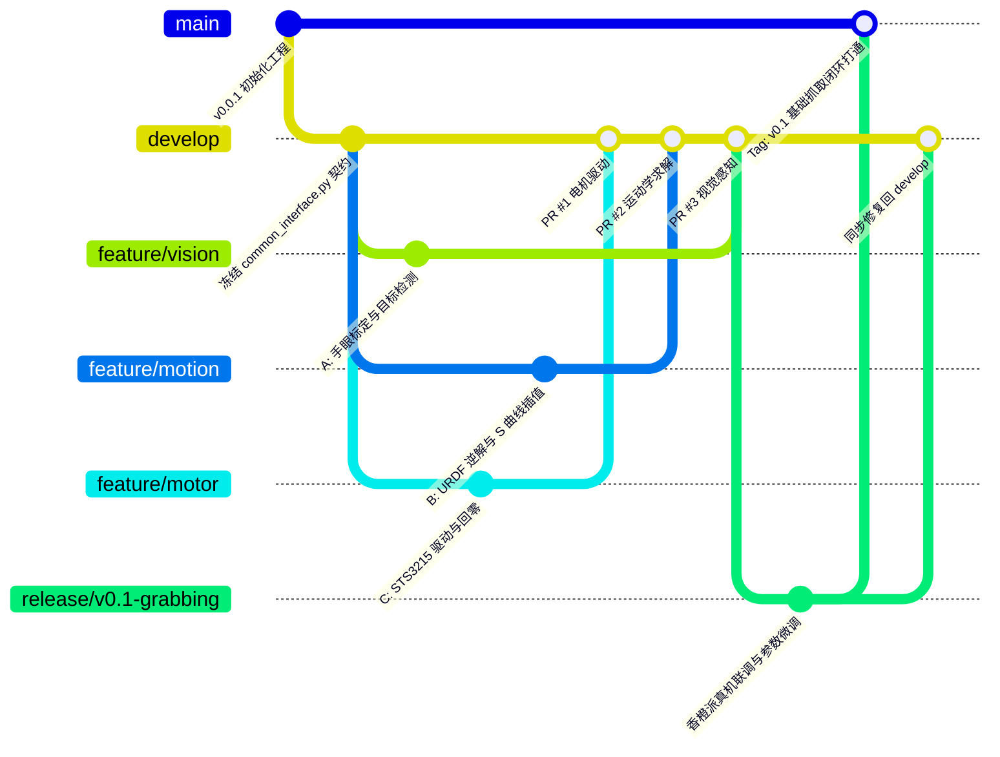

# 青云智臂
---

本项目由山西农业大学嵌入式实验室开发

> ### ⚠️ 当前实现状态（待完成）
>
> **本工程目前还不能端到端运行。** `python main.py` 不会有任何输出且退出码为 0——
> `main.py` 是 0 字节占位文件，**程序入口尚未实现**。
>
> 按实际文件行数核对（`wc -l`，2026-09-09）：
>
> | 模块 | 状态 | 行数 |
> |---|---|---|
> | `qingyun/grabbing/motor_control.py` | 已实现 | 1966 |
> | `qingyun/grabbing/arm_control.py` | 已实现 | 949 |
> | `qingyun/grabbing/safety.py` | 已实现 | 711 |
> | `qingyun/grabbing/kinematics_ext.py` | 已实现 | 580 |
> | `qingyun/grabbing/executor.py` | 已实现 | 379 |
> | `qingyun/grabbing/trajectory.py` | 已实现 | 314 |
> | `configs/common_interface.py`、`configs/motion_params.py` | 已实现 | — |
> | **`main.py`**（程序入口） | **待实现（0 字节）** | 0 |
> | **`qingyun/grabbing/vision.py`**（1号：视觉） | **待实现（0 字节）** | 0 |
> | **`qingyun/asr.py`**（语音转文字） | **待实现（0 字节）** | 0 |
> | **`qingyun/cloud_model.py`**（云端大模型） | **待实现（0 字节）** | 0 |
> | **`qingyun/watchdog.py`**（看门狗） | **待实现（0 字节）** | 0 |
>
> 另外，**真机标定尚未完成**：`calibration/` 下目前只有仿真配置可用，真机参数仍在
> 逐阶段测量中，进度与已知问题见
> [真机标定问题记录](dev_logs/真机标定问题记录.md)。在完成 8 阶段实机标定并通过
> `scripts/calibrate.py promote` 之前，**不得驱动真机**。
>
> 目前可用的部分是 `qingyun/grabbing/` 运动控制模块及其离线测试套件。

## 开发规范

### 1.工程结构图
```
Qingyun_arm
├── configs                     # 配置文件
│   ├── common_interface.py     # 冻结的公共接口契约
│   └── motion_params.py        # profile.json 加载与校验（已实现）
├── libs                        # 库文件
│   └── so_arm_core             # vendor 自 LeRobot 0.5.1，见 libs/so_arm_core/SOURCE.md
├── main.py                     # 程序入口            ⚠️ 待实现（0 字节）
├── calibration                 # 标定包（仿真可用，真机标定进行中）
├── docs                        # 技术与标定文档
├── scripts
│   └── calibrate.py            # 8 阶段标定 CLI（已实现）
├── qingyun                     # 核心功能包
│   ├── asr.py                  # 语音转文字模块      ⚠️ 待实现（0 字节）
│   ├── cloud_model.py          # 云端大模型模块      ⚠️ 待实现（0 字节）
│   ├── watchdog.py             # 看门狗              ⚠️ 待实现（0 字节）
│   └── grabbing                # 抓取模块（本期主要交付）
│       ├── arm_control.py      # 入口与编排（已实现）
│       ├── motor_control.py    # STS3215 驱动与换算（已实现）
│       ├── executor.py         # 轨迹回放（已实现）
│       ├── safety.py           # 限位与碰撞校验（已实现）
│       ├── trajectory.py       # 速度规划（已实现）
│       ├── kinematics_ext.py   # FK/IK 与工具变换（已实现）
│       └── vision.py           # 视觉接口            ⚠️ 待实现（0 字节）
└── readme.md
```
> 上表为 2026-09-09 的实际状态。标 **⚠️ 待实现** 的文件都是 0 字节占位，
> 里面没有任何代码；导入或执行它们不会报错，只会静默什么都不做。

### 2. 任务说明与分工

#### 前期开发

在开发前期，采用三人分工的合作模式，分工如下：  

---
**1号负责：开发项目的视觉部分，具体包括：**
- 在香橙派上驱动奥比中光深度相机
- 完成深度相机的手眼标定
- 训练模型与在香橙派上部署
- 输出目标的三维坐标与yaw姿态，以及目标品级
---

**2号负责：机械臂的运动学控制部分，具体包括:**
- 运动学正逆解
- 做好机械臂限位
- 规划机械臂运动路径
- 编排抓取动作流程
---
**3号负责：电机的控制部分，具体包括：**
- 电路与供电设计
- 完成舵机id烧录与零位和最大运动位置的标定
- 封装电机驱动
- 硬件级安全限幅

#### 开发后期

到时候再说

### 3. 接口约定

#### 常规约定

标准电机顺序（已对照本机 SO-ARM101 / LeRobot 源码）：
- 索引 0 / ID 1: shoulder_pan (底座旋转)
- 索引 1 / ID 2: shoulder_lift (大臂俯仰)
- 索引 2 / ID 3: elbow_flex (小臂俯仰)
- 索引 3 / ID 4: wrist_flex (手腕俯仰)
- 索引 4 / ID 5: wrist_roll (手腕旋转)
- 索引 5 / ID 6: gripper (夹爪，独立百分比字段，0=标定闭合端，100=标定张开端)

运动接口中的关节数组只含前 5 项，shape `(5,)`，单位为 URDF 坐标下的 deg；夹爪不混入关节角数组。坐标使用右手基座系 `base_link`，单位 m。

#### 开发前期接口约定

---
**视觉与算法接口约定：**
|     | 目标位置 | 目标角度 | 目标品级 |
|:---:|:-------:|:------:|:-------:|
| 物理含义 | 基座系中的目标三维几何中心 | 目标长轴在基座 XY 平面内相对 +X 的角度，绕 +Z 右手为正 | 记录用元数据 |
| 物理单位 | 米（m） | deg，模 180°，范围 `[-90, 90)` | A+、A、B、C（不合格） |
| 数据类型 | `np.float64` 的 `np.array`，shape `(3,)` | float | 字符串 |
| 举例 | `np.array([x,y,z], dtype=np.float64)` | `12.3` | `"A+"` |

视觉负责确定可抓取目标，使用 `VisionInterface(position, yaw_deg, grade)` 下发。通过 `ArmController.grasp_and_place(target, place_id="default")` 开始一次同步抓取—放置，调用返回后再进入下一次视觉检测。程序单线程顺序执行，控制不向视觉查询数据。

放置位置和角度保存在配置 `places[place_id]` 中，加载为 `PlacePose(position, yaw_deg)`；position 为释放时物体中心，yaw_deg 为物体长轴相对基座 +X 的角度。控制按指定 place_id 读取，不根据 grade 选择放置位置。

完整字段见 [common_interface.py](configs/common_interface.py) 和 [运动控制文档](docs/机械臂运动控制模块技术文档.md)。

---

**算法与电机控制接口约定:**

算法（运动控制）To 电机（驱动）——同线程函数调用，2号对 `MotorController` 接口编程，3号负责实现（`motor_control.py`），Mock 实现同一接口：

| | 关节角度指令 | 夹爪开合 | 状态反馈 | 保持 |
|:---:|:-------:|:------:|:-------:|:---:|
| 接口 | `send_action(joints_deg, gripper_pct)` | 同左，`gripper_pct` 参数 | `get_feedback() -> JointFeedback` | `hold_current() -> JointFeedback` |
| 物理单位 | deg（5 个姿态关节角） | 0~100（百分比） | 关节 deg / deg/s / mA；夹爪 % / %/s / mA | 实测角度和开度 |
| 数据类型 | `np.float64` 的 `np.array`，shape `(5,)` | float | `JointFeedback` 数据类 | 返回本次保持采用的反馈 |

到位等待由算法侧 `ArmController.wait_settled(target_deg, timeout_s) -> bool` 完成，同时检查目标角度误差、速度和持续时间。`ArmController` 可接收无阻塞的同步 `should_stop` 回调，在规划检查点和动作循环中检查停止条件。

约定细则：
1. **有界 I/O**：`send_action` 是有写超时的单次同步提交，不等待到位、不持有周期循环。整条参数检查通过后发送；越限抛 `MotorLimitError`，不静默裁剪。
2. **时钟节拍归算法侧（2号）**：30Hz 分段回放、反馈检查和到位等待在当前调用线程顺序执行，明显迟到时停止，不跳帧追赶。
3. **反馈单位与时序**：五关节角度/速度/电流与夹爪开度/速度/电流分开返回，附采样开始/结束时刻和递增序号。3号负责方向、零位和物理单位转换，通信失败抛异常。
4. **软件保持与物理急停**：`hold_current` 读一次有效反馈并写一次保持目标；异常后锁存故障并返回。调用返回后的保持由舵机已提交的位置目标维持。物理急停按钮直接切断舵机电源。

使用 `MotorController` Protocol 约束双方实现。`GraspResult` 返回状态、执行阶段、原因、place_id、夹持状态估计及是否需要复位。

详细实现见 [机械臂运动控制模块技术文档](docs/机械臂运动控制模块技术文档.md)；配置与测量方法见 [真机参数测量与标定指南](docs/真机参数测量与标定指南.md)。

### 4. 使用git和github管理开发

本项目采用规范的 **GitFlow 分支管理模型** 与 **GitHub Pull Request (PR)** 协作流程，确保 3 位同学并行开发互不干扰，主干代码时刻保持真机高可用。

#### 4.1 GitFlow 分支模型架构图



#### 4.2 核心分支角色与权限规则

| 分支名称 | 分支类型 | 来源与去向 | 核心权限与使用规范 |
| :--- | :--- | :--- | :--- |
| **`main`** | 主生产分支 | 仅接收 `release/*` 或 `hotfix/*` | **真机演示终极版本**。时刻保持绝对稳定，任何时候在香橙派上拉取均可直接运行。**严禁任何人直接 push！** |
| **`develop`** | 主集成开发分支 | 从 `main` 拉出，汇聚所有特性 | **日常联调中枢**。所有功能做完后通过 PR 汇聚于此。三位同学每天开工前从此处拉取最新代码。 |
| **`feature/*`** | 特性开发分支 | 从 `develop` 拉出，合并回 `develop` | **个人独立工作区**。包含 `feature/vision`（视觉）、`feature/motion`（运动学）、`feature/motor`（电机）。 |
| **`release/*`** | 阶段发布分支 | 从 `develop` 拉出，合并到 `main` 和 `develop` | **阶段性成果封版**（如中期检查、比赛演示）。用于真机参数微调并打 Tag。 |
| **`hotfix/*`** | 紧急修复分支 | 从 `main` 拉出，合并到 `main` 和 `develop` | **现场紧急救险**。用于现场演示前突发严重故障的紧急修复。 |

#### 4.3 团队日常开发标准化操作流程（5 步走）

##### 第一步：开工准备（拉取独立特性分支）
每天开始写新模块前，先将本地 `develop` 更新到最新，再创建自己的 Feature 分支：
```bash
git checkout develop
git pull origin develop

# 同学 A (视觉)
git checkout -b feature/vision-detector

# 同学 B (运动学 - 你)
git checkout -b feature/motion-kinematics

# 同学 C (电机)
git checkout -b feature/motor-driver
```

##### 第二步：本地迭代与规范提交（Commit Message）
在各自的分支上进行代码编写与 Mock 单元测试，遵循清晰的提交动词前缀：
```bash
git add qingyun/motion/
git commit -m "feat(motion): 完成五次多项式 S 曲线平滑轨迹发生器"
git push origin feature/motion-kinematics
```
* **提交前缀规范**：
  * `feat:` 新增功能特性
  * `fix:` 修复 Bug
  * `refactor:` 接口/代码重构（不改变功能）
  * `test:` 增加单元测试/Mock 脚本
  * `docs:` 更新 README/设计文档

##### 第三步：合并前同步（消除潜在冲突黄金法则）
当队友的代码率先合并进 `develop` 后，在发起 PR 之前，必须先将最新的 `develop` 合并到自己的分支并在本地测试通过：
```bash
git checkout feature/motion-kinematics
git pull origin develop   # 将远程最新的 develop 同步进当前特性分支
# 本地运行测试确认无误后推送
git push origin feature/motion-kinematics
```

##### 第四步：发起 Pull Request (PR) 与同行代码审查 (Code Review)
1. 登录 GitHub 仓库，点击 **"New Pull Request"**。
2. 设置：`base: develop` $\leftarrow$ `compare: feature/motion-kinematics`。
3. **分配 Reviewers**：勾选另外两位同学。
4. **审核要点**：
   * 确认未修改 `common_interface.py` 冻结的字段。
   * 确认单位严格符合公约（坐标 `float64`、角度 `deg`、速度 `deg/s`）。
5. 审查通过后点击 **"Squash and merge"** 合并，并删除远程特性分支。

##### 第五步：阶段封版发布与香橙派真机运行
当基础抓取模块全部合并到 `develop` 后，进行版本封版：
```bash
# 1. 建立 Release 分支
git checkout develop
git checkout -b release/v0.1-grabbing
git push origin release/v0.1-grabbing

# 2. 在香橙派 5 上拉取验证 (香橙派终端)
git fetch origin
git checkout release/v0.1-grabbing
python main.py
#    ⚠️ 待实现：main.py 目前是 0 字节占位文件，这条命令会静默返回且退出码 0。
#    它"跑通了"不代表抓取闭环可用，必须等入口与 vision 模块实现后再以此步验收。

# 3. 验证无误后合并到 main，并创建 GitHub Release Tag
git checkout main
git merge release/v0.1-grabbing
git tag -a v0.1-basic-grasping -m "完成视觉-运动学-电机基础抓取闭环"
git push origin main --tags
```

#### 4.4 团队协作防翻车 4 大铁律

1. **香橙派真机“只读”铁律**：
   * 严禁在香橙派 5 上直接修改业务代码或进行 Git 合并操作。
   * 香橙派只做一件事：从 GitHub 拉取通过测试的代码并执行（`git pull` $\rightarrow$ `python main.py`）。
   * ⚠️ **待完成**：上面这条链路目前走不通——`main.py` 与 `qingyun/grabbing/vision.py`
     都还是 0 字节占位。在入口实现之前，真机上唯一可用的验证路径是离线测试套件与
     `scripts/calibrate.py` 的只读采集（**注意：只读采集不等于可以运动**）。
2. **`common_interface.py` 契约绝对冻结**：
   * 任何人不得单方面修改公共数据结构与枚举。若确需增减字段，必须 3 人协商一致后单独提交 `refactor(interface)` PR。
3. **严禁将大文件与权重提交至 Git 仓库**：
   * 模型权重 (`.pt`, `.rknn`, `.onnx`)、测试视频 (`.mp4`, `.bag`) 一律通过网盘共享或上传至 GitHub Release 附件，严禁直接 `git add`。
4. **小步快跑，严禁巨型 PR**：
   * 单个功能完成即提 PR 合并，每次 PR 变更文件数建议控制在 5 个以内，便于审查和快速定位问题。